<div align="center">

# 🚀 Infomatics AI Hiring Platform

**Intelligent Recruitment Made Simple**

[](https://python.org)
[](https://flask.palletsprojects.com)
[](https://supabase.com)
[](#)
[](LICENSE)

*Revolutionizing campus recruitment with AI-powered resume analysis and intelligent job matching*

[📖 Documentation](#-documentation) • [🚀 Quick Start](#-quick-start) • [🎯 Features](#-features) • [🔧 Setup](#-setup) • [📱 Demo](#-demo)

</div>

---

## 🌟 Overview

The **Infomatics AI Hiring Platform** is a cutting-edge recruitment solution designed specifically for educational institutions. It combines the power of artificial intelligence with modern web technologies to streamline the entire hiring process, from job posting to candidate evaluation.

### 🎯 What Makes It Special?

- **🤖 AI-Powered Resume Analysis** - Automatically extract skills, experience, and qualifications
- **📊 Intelligent Job Matching** - Smart relevance scoring and candidate ranking
- **🗣️ Natural Language Queries** - Ask questions about your data in plain English
- **📧 Automated Communication** - Seamless email notifications and updates
- **📱 Mobile-First Design** - Responsive interface for all devices

---

## ✨ Features

### 👨‍🎓 For Students
<div align="center">

| Feature | Description |
|---------|-------------|
| 🔍 **Job Discovery** | Browse and search through available opportunities |
| 📄 **Resume Upload** | Easy PDF/DOCX resume submission |
| 📈 **Application Tracking** | Real-time status updates |
| 📧 **Email Notifications** | Stay informed about your applications |

</div>

### 🏢 For Placement Department
<div align="center">

| Feature | Description |
|---------|-------------|
| 📝 **Job Management** | Create, edit, and manage job postings |
| 🤖 **AI Evaluation** | Automated resume analysis and scoring |
| 📊 **Analytics Dashboard** | Comprehensive recruitment insights |
| 🗣️ **NLP Queries** | Ask questions about your data naturally |
| 📧 **Bulk Communication** | Send emails to multiple candidates |

</div>

### 🧠 AI-Powered Capabilities
<div align="center">

| Capability | Technology | Benefit |
|------------|------------|---------|
| **Resume Parsing** | PDFplumber + LLM | Extract structured data from resumes |
| **Skill Matching** | Semantic Analysis | Match candidates to job requirements |
| **Relevance Scoring** | ML Algorithms | Rank candidates by fit |
| **Natural Language** | Groq/Gemini AI | Query data in plain English |
| **Feedback Generation** | LLM Processing | Generate candidate insights |

</div>

---

## 🛠️ Technology Stack

<div align="center">

### Backend


### AI & ML


### Frontend


</div>

---

## 🚀 Quick Start

### Prerequisites
- Python 3.10 or higher
- Supabase account
- Groq or Gemini API key
- SMTP email configuration

### 1️⃣ Clone & Install
```bash
# Clone the repository
git clone https://github.com/yourusername/infomatics-ai-hiring-platform.git
cd infomatics-ai-hiring-platform

# Install dependencies
pip install -r requirements.txt
```

### 2️⃣ Environment Setup
```bash
# Copy environment template
cp env.example .env

# Edit .env with your configuration
nano .env
```

### 3️⃣ Database Configuration
```bash
# Set up Supabase database
# 1. Create new Supabase project
# 2. Run database_schema.sql
# 3. Configure storage buckets
# 4. Set up RLS policies
```

### 4️⃣ Run the Application
```bash
# Development mode
python app.py

# Production mode
gunicorn app:app
```

---

## ⚙️ Configuration

### Environment Variables
```env
# 🔐 Supabase Configuration
SUPABASE_URL=https://your-project.supabase.co
SUPABASE_ANON_KEY=your-anon-key
SUPABASE_SERVICE_ROLE_KEY=your-service-role-key

# 🤖 AI Configuration
GROQ_API_KEY=your-groq-api-key
GEMINI_API_KEY=your-gemini-api-key
LLM_PROVIDER=groq

# 📧 Email Configuration
SMTP_HOST=smtp.gmail.com
SMTP_PORT=587
SMTP_USER=your-email@gmail.com
SMTP_PASS=your-app-password

# 🔑 Flask Configuration
SECRET_KEY=your-secret-key-here
```

---

## 📊 Database Schema

### Core Tables
```sql
-- 👨‍🎓 Students
CREATE TABLE students (
    id UUID PRIMARY KEY DEFAULT gen_random_uuid(),
    full_name TEXT NOT NULL,
    email TEXT UNIQUE NOT NULL,
    phone TEXT,
    college TEXT,
    created_at TIMESTAMP WITH TIME ZONE DEFAULT NOW()
);

-- 💼 Jobs
CREATE TABLE jobs (
    id UUID PRIMARY KEY DEFAULT gen_random_uuid(),
    title TEXT NOT NULL,
    company TEXT NOT NULL,
    location TEXT NOT NULL,
    description TEXT NOT NULL,
    requirements TEXT,
    salary TEXT,
    deadline DATE,
    status TEXT DEFAULT 'active',
    created_at TIMESTAMP WITH TIME ZONE DEFAULT NOW()
);

-- 📋 Applications
CREATE TABLE applications (
    id UUID PRIMARY KEY DEFAULT gen_random_uuid(),
    student_id UUID REFERENCES students(id),
    job_id UUID REFERENCES jobs(id),
    resume_url TEXT,
    relevance_score INTEGER,
    verdict TEXT,
    skills TEXT[],
    experience TEXT,
    summary TEXT,
    status TEXT DEFAULT 'pending',
    created_at TIMESTAMP WITH TIME ZONE DEFAULT NOW()
);
```

---

## 🔌 API Endpoints

### Jobs Management
```http
POST   /api/jobs          # Create job posting
GET    /api/jobs          # List jobs with filtering
GET    /api/jobs/{id}     # Get specific job
PUT    /api/jobs/{id}     # Update job
DELETE /api/jobs/{id}     # Delete job
```

### Applications
```http
POST   /api/apply         # Submit application
GET    /api/applications  # List applications
GET    /api/application/{id} # Get application details
PATCH  /api/applications/{id} # Update application
```

### AI Features
```http
POST   /api/evaluate      # AI resume evaluation
POST   /api/nlpsql        # Natural language to SQL
POST   /api/email/send    # Send email notifications
```

---

## 🤖 AI Pipeline

```mermaid
graph TD
    A[📄 Resume Upload] --> B[🔍 Text Extraction]
    B --> C[🧠 LLM Analysis]
    C --> D[📊 Skill Matching]
    D --> E[🎯 Relevance Scoring]
    E --> F[📝 Feedback Generation]
    F --> G[💾 Database Update]
    G --> H[📧 Notification]
```

<div align="center">



</div>

### AI Evaluation Process
1. **📄 Text Extraction** - Extract text from PDF/DOCX files
2. **🧠 LLM Analysis** - Parse resume and job requirements
3. **📊 Skill Matching** - Match candidate skills to job needs
4. **🎯 Relevance Scoring** - Calculate compatibility score (0-100)
5. **📝 Feedback Generation** - Generate strengths and weaknesses
6. **💾 Database Update** - Store evaluation results
7. **📧 Notification** - Send automated updates

---

## 🚀 Deployment

### Vercel Deployment
```bash
# 1. Push to GitHub
git push origin main

# 2. Connect to Vercel
# 3. Set environment variables
# 4. Deploy automatically
```

### Docker Deployment
```dockerfile
FROM python:3.10-slim
WORKDIR /app
COPY requirements.txt .
RUN pip install -r requirements.txt
COPY . .
EXPOSE 5000
CMD ["python", "app.py"]
```

---

## 📱 Screenshots

<div align="center">

| Student Dashboard | Placement Dashboard | AI Analytics |
|-------------------|-------------------|--------------|
|  |  |  |

</div>

---

## 🤝 Contributing

We welcome contributions! Please see our [Contributing Guidelines](CONTRIBUTING.md) for details.

### Development Setup
```bash
# Fork and clone
git clone https://github.com/yourusername/infomatics-ai-hiring-platform.git

# Create feature branch
git checkout -b feature/amazing-feature

# Make changes and commit
git commit -m "Add amazing feature"

# Push and create PR
git push origin feature/amazing-feature
```

---

## 📄 License

This project is licensed under the MIT License - see the [LICENSE](LICENSE) file for details.

---

## 🙏 Acknowledgments

- **Supabase** for the amazing backend infrastructure
- **Groq** for lightning-fast AI inference
- **Flask** for the robust web framework
- **OpenAI** for the powerful language models

---

## 📞 Support

<div align="center">

| Support Channel | Description |
|----------------|-------------|
| 🐛 **Issues** | [GitHub Issues](https://github.com/yourusername/infomatics-ai-hiring-platform/issues) |
| 💬 **Discussions** | [GitHub Discussions](https://github.com/yourusername/infomatics-ai-hiring-platform/discussions) |
| 📧 **Email** | support@infomatics-hiring.com |
| 📖 **Documentation** | [Full Documentation](https://docs.infomatics-hiring.com) |

</div>

---

<div align="center">

**⭐ Star this repository if you found it helpful!**

Made with ❤️ by the Infomatics Team

[](https://github.com/yourusername/infomatics-ai-hiring-platform)
[](https://github.com/yourusername/infomatics-ai-hiring-platform/fork)

</div>
